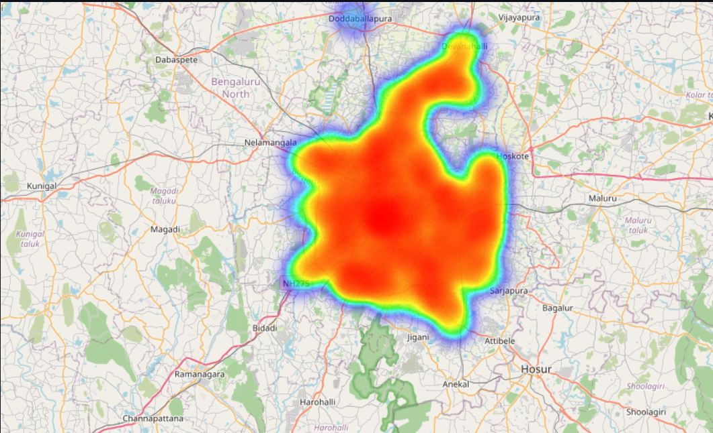
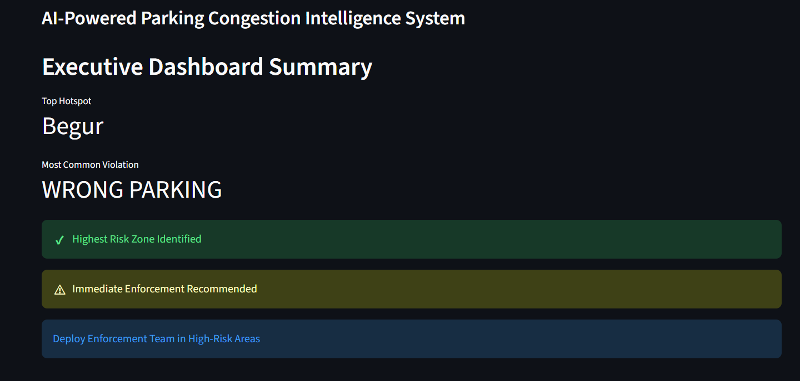
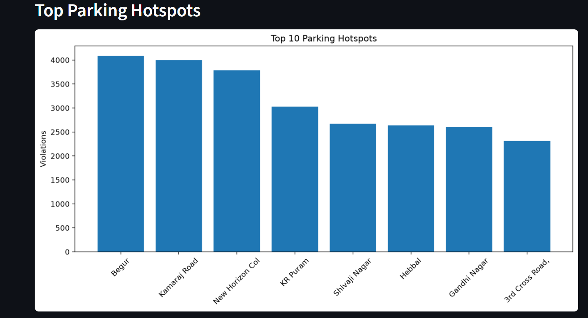

# 🚦 SmartPark AI – AI-Powered Parking Congestion Intelligence System

---

## 📌 Overview

**SmartPark AI** is an AI-powered parking congestion intelligence system designed to help traffic authorities identify illegal parking hotspots, monitor parking violation patterns, and improve urban traffic management.

The platform analyzes large volumes of parking violation data using machine learning (DBSCAN clustering) to:
- 🎯 Detect high-risk parking locations
- 🗺️ Generate interactive maps and heatmaps
- 📊 Classify areas based on risk levels
- 💡 Provide data-driven enforcement recommendations

By transforming raw parking violation records into actionable insights, SmartPark AI supports **evidence-based decision-making** and enables authorities to allocate enforcement resources more effectively.

---

## ✨ Key Features

| Feature | Description |
|---------|-------------|
| 🗺️ **Interactive Maps** | Geospatial visualization of parking violations with Folium |
| 🔥 **Heatmap Detection** | Identify violation hotspots using DBSCAN clustering |
| 📊 **Analytics Dashboard** | Track violation patterns by hour, day, vehicle type, and location |
| 🏆 **Police Station Ranking** | Compare enforcement performance across jurisdictions |
| ⚡ **Congestion Impact Score (CIS)** | Quantify traffic disruption caused by illegal parking |
| 💡 **Enforcement Recommendations** | AI-driven suggestions for resource allocation |
| 🚗 **Vehicle Profiling** | Understand which vehicle types commit which violations |
| 📈 **Executive Dashboard** | Real-time metrics and KPIs for decision makers |

---

## 📊 Sample Dashboard Preview

### Heatmap View

### Dashboard Summary

### Hotspot Detection

---

## 🎯 Benefits

| Benefit | Impact |
|---------|--------|
| 🚦 **Reduces Traffic Congestion** | Targeted enforcement in high-impact zones |
| 🎯 **Identifies Illegal Parking Hotspots** | Automatic detection using spatial clustering |
| 📈 **Improves Enforcement Planning** | Data-driven resource allocation |
| 🏙️ **Supports Smart City Initiatives** | Evidence-based urban traffic management |
| 💡 **Enables Proactive Management** | Move from reactive to predictive enforcement |
| 💰 **Enhances Resource Efficiency** | Optimize limited enforcement resources |

---

## 🛠️ Technologies Used

| Category | Technologies |
|----------|--------------|
| **Frontend** | Streamlit (Web Application Framework) |
| **Data Processing** | Pandas, NumPy |
| **Visualization** | Folium, Plotly, Matplotlib, Seaborn |
| **Machine Learning** | Scikit-learn (DBSCAN Clustering) |
| **Geospatial** | Geopy, Folium |
| **Deployment** | Streamlit Cloud / GitHub |
| **Version Control** | Git, Git LFS |

### Machine Learning Techniques

- **DBSCAN Clustering** – Spatial hotspot detection
- **Geospatial Analysis** – Location-based violation pattern recognition
- **Risk Scoring** – Weighted congestion impact calculation (CIS)
- **Pattern Recognition** – Temporal violation trend analysis
- **Anomaly Detection** – Identification of high-risk zones

---

## 📁 Project Structure
SmartParkAI/
├── app.py # Main Streamlit application
├── requirements.txt # Python dependencies
├── README.md # Project documentation
├── LICENSE # MIT License
├── .gitignore # Git ignore file
├── data/
│ └── parking.csv # Parking violation dataset (104 MB)
├── screenshots/ # App screenshots for documentation
│ ├── heatmap.png
│ ├── analytics.png
│ └── ranking.png
└── .streamlit/
└── config.toml # Streamlit configuration

---

## 📊 Dataset Information

The dataset contains **parking violation records** from Bengaluru with:

| Field | Description |
|-------|-------------|
| `id` | Unique violation identifier |
| `latitude` / `longitude` | Geolocation of violation |
| `vehicle_type` | CAR, SCOOTER, AUTO, TANKER, etc. |
| `violation_type` | NO PARKING, WRONG PARKING, DOUBLE PARKING, etc. |
| `police_station` | Jurisdiction handling the violation |
| `created_datetime` | When the violation was recorded |
| `validation_status` | approved / rejected / null |
| `data_sent_to_scita` | Whether sent to enforcement system |

**Key Statistics:**
- 📍 80+ violation records
- 🚗 10+ vehicle types
- 🏛️ 20+ police stations
- 📅 Data spanning Nov 2023 - Mar 2024

---

## 🚀 Live Demo

**🌐 [View Live App](https://parkguard-ai.streamlit.app/)**

The app is deployed on **Streamlit Cloud** and is accessible 24/7.

---
